# Flujo del chatbot ante un mensaje entrante

Cómo procesa el sistema un WhatsApp del estudiante, de punta a punta. El caso de
una **conversación nueva** (número que escribe por primera vez) está marcado al
final.

## Diagrama (Mermaid)

```mermaid
flowchart TD
    A([📱 Alumno manda WhatsApp]) --> B[Meta WhatsApp Cloud API<br/>POST /api/webhooks/whatsapp]
    B -->|valida firma HMAC<br/>parsea mensaje| C[[Cola Celery · Redis<br/>process_incoming_message]]
    C --> D[Worker · _process_async]

    D --> E[1 · upsert_by_phone<br/>student, student_created]
    E --> F[2 · get_or_create_open<br/>conv, created, reopened]
    F -->|created| F1[limpia cache de historial]
    F -->|cerrada| F2[reabre estilo Chatwoot]
    F --> G[3 · Insert inbound<br/>idempotente por meta_message_id]
    G -->|duplicado| GX([rollback + STOP])
    G --> H[publica message.created → WS]
    H --> I[4 · Clasificar intent<br/>SBERT; LLM si score &lt; 0.55]

    I --> J{¿conv en takeover?}
    J -->|sí| JX([STOP · responde el admin])
    J -->|no| K{¿intent = solicita_humano?}
    K -->|sí| KX([Escala: takeover + aviso al alumno + push<br/>STOP · sin RAG])
    K -->|no| L{¿primer contacto?<br/>student_created}
    L -->|sí| M[Enviar WELCOME canned]
    L -->|no| N[6 · Cargar historial<br/>Redis 24h → DB fallback]
    M --> N
    N --> O[7 · Cargar perfil + program<br/>get_profile_scope por teléfono]
    O --> P[8 · RAG · rag_service.answer]

    subgraph RAG [Agente RAG · OpenAI]
        direction TB
        P1[system prompt activo + perfil del alumno] --> P2[create_agent con tools]
        P2 --> P3{el LLM decide}
        P3 -->|buscar| P4[search_knowledge_base&#40;query&#41;<br/>embebe query → pgvector cosine<br/>WHERE program IS NULL OR = :program]
        P4 --> P3
        P3 -->|responder| P5[compone la respuesta]
        P3 -->|escalar| P6[escalate_to_human]
    end

    P --> RAG
    RAG --> Q[9 · Enviar respuesta por WhatsApp]
    Q --> R[10 · Persistir bot msg<br/>tokens · latencia · chunks]
    R --> S{¿el agente llamó escalate?}
    S -->|sí| SX[takeover + push a admins]
    S -->|no| T[12 · commit + append historial + publish]
    SX --> T
    T --> U([Redis pub/sub → WebSocket → 🖥️ CRM en vivo])
```



## Etapas (1 línea por paso)

| # | Etapa | Qué decide / hace | Toca |
|---|-------|-------------------|------|
| 1–2 | **Identidad** | Quién (teléfono→student) y dónde va (1 conversación por número; reabre si estaba cerrada) | Postgres, Redis |
| 3 | **Persistencia** | Guarda el inbound; idempotente (si Meta reintenta, no duplica) | Postgres |
| 4 | **Intent (SBERT)** | Etiqueta el mensaje; rápido y local, LLM solo si duda (&lt; 0.55) | SBERT / OpenAI |
| ⎇ | **Ruteo** | Si es *takeover* o "quiero humano" → corta antes del RAG | Meta, Postgres, FCM |
| 5 | **Welcome** | Solo en el **primer contacto** del número | Meta |
| 6–7 | **Contexto** | Historial (24h) + perfil académico + **carrera para el scope** | Redis, Postgres |
| 8 | **RAG** | El agente busca en la KB **scopeada a su carrera** y responde (o escala) | OpenAI, pgvector |
| 9–12 | **Salida** | Manda por WhatsApp, persiste métricas, emite eventos en vivo al CRM | Meta, Postgres, Redis, FCM |

## Componentes / data stores

| Símbolo | Componente | Rol |
|---------|-----------|-----|
| Meta | WhatsApp Cloud API | Recibe (webhook) y envía mensajes |
| Cola Celery | Redis (broker) | Desacopla el webhook del procesamiento pesado |
| Postgres | Base de datos + **pgvector** | Mensajes, conversaciones, perfiles, chunks + embeddings |
| Redis | Cache | Historial (24h), generation counters (prompt/intents), pub/sub de eventos |
| SBERT | modelo local | Clasificación de intención (paraphrase-multilingual-MiniLM-L12-v2) |
| OpenAI | LLM + embeddings | Respuesta del agente, fallback de intent, embeddings de RAG |
| FCM | Web Push | Notifica a los admins ante una escalación |
| WebSocket | Redis pub/sub → CRM | Actualiza el panel en tiempo real |

## Específico de una conversación **nueva**

Número que escribe por primera vez:

1. `student_created = True` → se crea el `student`.
2. `conv_created = True` → conversación nueva **+ historial limpio** (sin memoria previa).
3. Se manda el **WELCOME** (saludo canned) antes de la primera respuesta del bot.
4. Historial vacío → el agente **siempre busca** en la KB (no hay respuesta vieja
   que copiar). *(Esto explica por qué un hilo "envenenado" repetía respuestas
   viejas: bastaba con eliminar la conversación para forzar una búsqueda fresca.)*

## Caminos que cortan antes del RAG (ahorran costo/latencia)

- **Conversación en takeover**: un humano la tomó → el bot no responde.
- **Intent `solicita_humano`**: escala determinísticamente (takeover + aviso fijo
  al alumno + push a admins), sin gastar el agente RAG.
- **Inbound duplicado** (reintento de Meta): rollback y corta.

## Detalle del scope por carrera (SW-46)

Dentro de `search_knowledge_base`, el retrieval filtra:

```sql
WHERE documents.program IS NULL          -- docs generales (fechas, becas…): visibles a todos
   OR documents.program = :program       -- la malla de la carrera del alumno
```

El `:program` sale del perfil del alumno (`canonical_program(career)`); si no hay
perfil o la carrera no normaliza, va `NULL` → **fail-open** (búsqueda global, como
antes). Así el bot no mezcla la malla de Sistemas con la de Ciencias de la
Computación.
